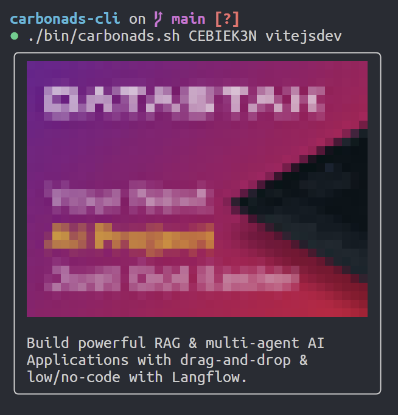

# 🎬 CarbonAds CLI

A simple Bash script to display [Carbon Ads](https://carbonads.net/) in your terminal with image and description, formatted in a stylish ASCII box.

> Open sourced tweet <https://x.com/okineadev/status/1902267640262873119>



## Requirements

- [viu](https://github.com/atanunq/viu) — for rendering images in the terminal.
- `curl`, `jq`, and `sed` (usually available on most Unix systems).

## Installation

1. Download the script:

   ```bash
   wget https://github.com/okineadev/carbonads-cli/raw/refs/heads/main/bin/carbonads.sh
   ```

2. Make the script executable:

   ```bash
   chmod +x carbonads.sh
   ```

3. Install [viu](https://github.com/atanunq/viu) if you don't have it:

   ```bash
   # On Linux (using cargo)
   cargo install viu
   # Or see the viu repo for other installation methods
   ```

## Usage

Run the script with your Carbon Ads ID and placement:

```bash
./carbonads.sh <id> <placement>
```

- `<id>`: Your Carbon Ads ID
- `<placement>`: The placement segment for the ad

Example:

```bash
./carbonads.sh CEBIEK3N vitejsdev
```

> [!TIP]
> 🔥 **Pro Tip**: Add this to your **MOTD** so that every time you enter the terminal you see an ad, thereby supporting your favorite creator 😁

## License

[MIT License](./LICENSE) © 2025-present [Yurii Bogdan](https://github.com/okineadev)
